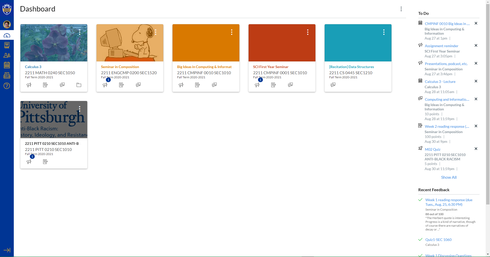
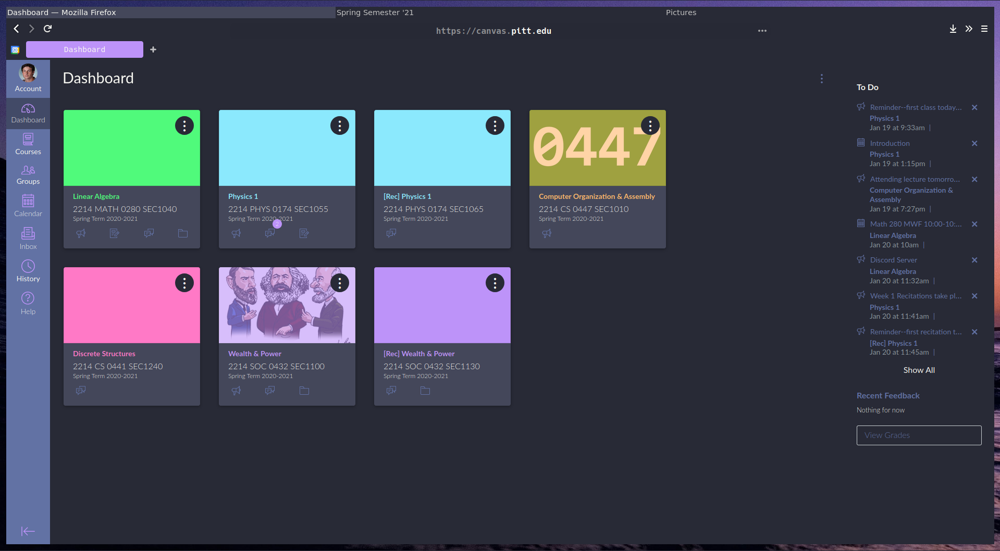
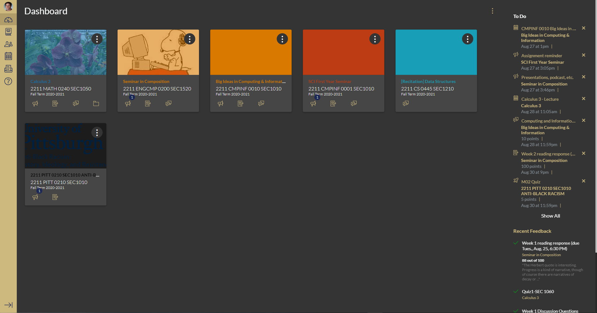

# pitt-canvas-dark-mode
 
Dark mode for the Canvas web app for University of Pittsburgh students with the classic Pitt colors. #h2p

## Installation
 
1. Download Stylus for your browser:
  - [Chrome and Edge](https://chrome.google.com/webstore/detail/stylus/clngdbkpkpeebahjckkjfobafhncgmne?hl=en)
  - [Firefox](https://addons.mozilla.org/firefox/addon/styl-us/)

<h2>Install the Dracula theme:</h2>
 
_Based off of [https://draculatheme.com/](https://draculatheme.com/)._
 

 
<h2>Install the Nord theme:</h2>
 
_Based off of [https://www.nordtheme.com/](https://www.nordtheme.com/)._
 
 
 
<h2>Install the dark theme:</h2>
 

No theme:

Dracula theme:

Dark theme:

*** In the Stylus extension you can edit the theme to your liking. (Ctrl+F and replace all hex codes to ones of your liking. Gold is #CDB87D; Navy is #1C2957).

_Note_ 
Make sure to keep the theme updated in the Stylus extension. Your canvas pages may look a little different than mine and have pages I was unable to edit. Sorry for any inconveniences.
