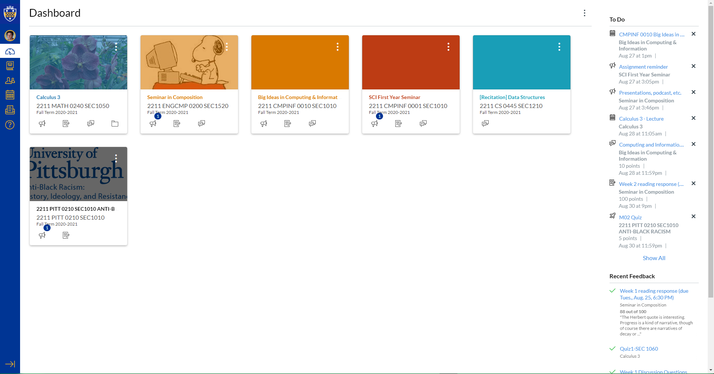

# pitt-canvas-dark-mode
 
Dark mode for the Canvas web app for University of Pittsburgh students with the classic Pitt colors. #h2p

## Installation
1. Download Stylus for your browser: 
  - [Chrome and Edge](https://chrome.google.com/webstore/detail/stylus/clngdbkpkpeebahjckkjfobafhncgmne?hl=en)
  - [Firefox](https://addons.mozilla.org/firefox/addon/styl-us/)
2. Install the theme:  

  

*** In the Stylus extension you can edit the theme to your liking. (Ctrl+F and replace all hex codes to ones of your liking)

_Note_ 
Your canvas pages may look a little different than mine and have pages I was unable to edit. Sorry for any inconveinces.
